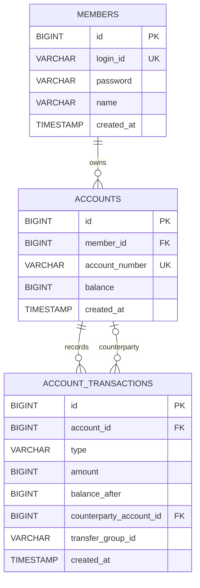

# MiniBank ERD 초안

## 1. 설계 방향

v1.0은 회원·계좌·계좌 거래내역의 세 테이블로 구성한다. 이체를 별도 테이블로 만들지 않고, 한 번의 이체에서 생성된 출금·입금 내역 두 건을 같은 `transfer_group_id`로 연결한다.

계좌의 `balance`는 화면 조회와 조건부 출금에 사용하는 현재 잔액이다. `account_transactions`는 잔액이 바뀐 사실을 남기는 append-only 이력이다. 두 값은 같은 트랜잭션 안에서 함께 변경되어야 한다.

이 초안은 MVC와 Repository 구현을 시작할 기준으로 승인했다. H2 문법, `balance_after` 생성 방식과 고급 잠금 전략은 DB1 통합 테스트 결과에 따라 조정할 수 있다.

## 2. 관계



## 3. 테이블 정의

### 3.1 members

| 컬럼 | 타입 | 제약조건 | 설명 |
|---|---|---|---|
| `id` | `BIGINT` | PK, identity | 내부 회원 ID |
| `login_id` | `VARCHAR(20)` | NOT NULL, UNIQUE | 로그인 ID |
| `password` | `VARCHAR(100)` | NOT NULL | v1.0 학습용 비밀번호 저장 |
| `name` | `VARCHAR(30)` | NOT NULL | 회원 이름 |
| `created_at` | `TIMESTAMP` | NOT NULL | 가입 시각 |

로그인 ID는 영문 소문자와 숫자로 구성된 4~20자, 이름은 공백을 제외하고 2~30자로 제한한다. 비밀번호는 8~64자로 검증하되 v1.0에서 암호화를 구현하지 않으므로 실제 서비스에 사용하지 않는다.

### 3.2 accounts

| 컬럼 | 타입 | 제약조건 | 설명 |
|---|---|---|---|
| `id` | `BIGINT` | PK, identity | 내부 계좌 ID |
| `member_id` | `BIGINT` | NOT NULL, FK | 소유 회원 ID |
| `account_number` | `VARCHAR(12)` | NOT NULL, UNIQUE | 사용자에게 보여주는 12자리 계좌번호 |
| `balance` | `BIGINT` | NOT NULL, CHECK >= 0 | 현재 잔액 |
| `created_at` | `TIMESTAMP` | NOT NULL | 계좌 개설 시각 |

계좌번호는 서버가 숫자 12자리로 생성한다. v1.0에서는 이체 대상 입력에 필요하므로 전체 번호를 화면에 표시한다. 계좌 삭제 기능은 만들지 않는다.

동시 출금은 `version`을 이용한 낙관적 락 대신 다음 조건부 UPDATE로 처리한다.

```sql
update accounts
set balance = balance - ?
where id = ?
  and balance >= ?;
```

수정된 행이 1건일 때만 성공이며, 0건이면 잔액 부족 또는 다른 요청이 먼저 잔액을 사용한 것으로 처리한다.

### 3.3 account_transactions

| 컬럼 | 타입 | 제약조건 | 설명 |
|---|---|---|---|
| `id` | `BIGINT` | PK, identity | 거래내역 ID |
| `account_id` | `BIGINT` | NOT NULL, FK | 내역이 속한 계좌 |
| `type` | `VARCHAR(20)` | NOT NULL | 거래 유형 |
| `amount` | `BIGINT` | NOT NULL, CHECK > 0 | 거래 금액 |
| `balance_after` | `BIGINT` | NOT NULL, CHECK >= 0 | 거래 직후 잔액 |
| `counterparty_account_id` | `BIGINT` | NULL, FK | 이체 상대 계좌 |
| `transfer_group_id` | `VARCHAR(36)` | NULL | 이체 내역 두 건의 연결 ID |
| `created_at` | `TIMESTAMP` | NOT NULL | 거래 시각 |

거래 유형은 `DEPOSIT`, `WITHDRAWAL`, `TRANSFER_IN`, `TRANSFER_OUT` 네 가지다. 일반 입출금의 상대 계좌와 이체 그룹 ID는 `NULL`이다. 이체 내역은 두 값이 모두 존재해야 한다.

거래내역은 생성 후 수정하거나 삭제하지 않는다.

## 4. 인덱스와 제약조건

| 대상 | 목적 |
|---|---|
| `members(login_id)` UNIQUE | 로그인 조회와 중복 방지 |
| `accounts(account_number)` UNIQUE | 이체 계좌 조회와 중복 방지 |
| `accounts(member_id)` | 회원별 계좌 목록 |
| `account_transactions(account_id, created_at)` | 계좌별 최신 거래 조회 |
| `account_transactions(transfer_group_id)` | 이체 내역 두 건 추적 |

DB 제약조건은 애플리케이션 검증을 대신하지 않는다. Service에서 먼저 의미 있는 오류를 만들고, DB 제약조건은 마지막 방어선으로 사용한다.

## 5. 잔액과 거래내역 일관성

v1.0에서는 조건부 UPDATE와 하나의 Service 트랜잭션으로 기본 정합성을 먼저 구현한다.

- 출금은 `balance >= amount` 조건이 포함된 UPDATE로 처리한다.
- 이체의 출금·입금·거래내역 두 건은 하나의 `@Transactional` 메서드에서 함께 성공하거나 롤백한다.
- 잔액 변경과 거래내역 저장은 같은 트랜잭션에 포함한다.
- `balance_after` 필드는 유지하되 생성 방식과 동시 요청에서의 일관성은 JDBC 통합 테스트로 확인한다.

두 계좌를 `SELECT FOR UPDATE`로 잠그거나 작은 계좌 ID 순서로 잠금을 얻는 방식은 필수 구현이 아니라 검증 후보로 둔다. 양방향 동시 이체에서 교착이나 `balance_after` 불일치가 재현될 때 적용하고, H2에서의 실제 동작을 테스트한다.

## 6. 구현 전 확인

- [x] 회원 1:N 계좌 관계를 정했다.
- [x] 계좌 1:N 거래내역 관계를 정했다.
- [x] 계좌번호 형식과 길이를 정했다.
- [x] 동시 출금 전략을 조건부 UPDATE로 정했다.
- [x] 이체 내역 두 건의 연결 방식을 정했다.
- [x] 거래내역을 append-only로 정했다.
- [ ] H2용 `schema.sql` 문법을 DB1 단계에서 검증한다.
- [ ] `balance_after` 생성 방식과 동시 요청 일관성을 검증한다.
- [ ] 문제가 재현될 경우 행 잠금과 교착 회피 전략을 적용한다.
